# AI 코딩 하네스 벤치마크

같은 prompt 로 5개 Claude Code 하네스를 비교합니다. 과제는 어린이용 3D
창의 학습 플랫폼 MVP 구축 (`benchmarks/prompt.md`).

| 하네스 | 동작 방식 | 활성화 증거 |
|---|---|---|
| `vanilla` | plugin/skill 없는 순정 Claude Code | 기준선 |
| `oma` | `oh-my-agent` 소스를 프로젝트에 시드 (`.agents/` + `.claude/`) | design rule 기반 anti-pattern 회피, deferred-stub 마커 |
| `omc` | `--plugin-dir` 로 `oh-my-claudecode` 로드 | 자기 보고 "OMC loaded, 40+ skills" |
| `ecc` | `everything-claude-code` 를 사용자 `~/.claude/` 에 설치 | 세션 skill 목록이 ecc skills 로 확장됨 |
| `superpowers` | `--plugin-dir` 로 `superpowers` 로드 | 첫 실행에서 brainstorming skill 의 `<HARD-GATE>` 발동 (강제 우회 prompt 로 진행) |

실행 조건: `claude-opus-4-6`, effort `max`, `--max-budget-usd 20`,
`--no-session-persistence`, `--setting-sources project,local`, 동일 raw prompt.
ANTHROPIC_API_KEY 미설정. 사용자가 로그인한 `claude` CLI 의 OAuth 사용.

---

## 최종 점수표 (5축, 총 100점)

| 순위 | 하네스 | **총점** | Func/35 | Spec/15 | Visual/20 | Eng/20 | Eff/10 |
|---|---|---|---|---|---|---|---|
| 🥇 1 | **oma** | **88.0** | 35 | 13 | 16 | 16 | 8 |
| 🥈 2 | superpowers | 74.0 | 30 | 8 | 14 | 14 | 8 |
| 🥉 3 | omc | 73.0 | 33.5 | 7 | 13 | 14.5 | 5 |
| 4 | vanilla | 69.0 | 28.5 | 12 | 10 | 12.5 | 6 |
| 5 | ecc | 68.5 | 28.5 | 8 | 13 | 15 | 4 |

### 실행 비용

| 하네스 | 턴 수 | 소요 시간 | 비용 | 파일 수 (src) | 파일당 비용 |
|---|---|---|---|---|---|
| vanilla | 42 | 8m 56s | $2.37 | 16 | $0.15 |
| oma | 18 | 2m 42s | $6.57 | 24 | $0.27 |
| omc | 61 | 9m 02s | $1.92 | 14 | $0.14 |
| ecc | 79 | 10m 20s | $3.84 | 22 | $0.17 |
| superpowers | 39 | 8m 13s | $1.28 | 18 | $0.07 |

---

## 스크린샷 비교

### 랜딩 페이지

| vanilla | oma | omc | ecc | superpowers |
|---|---|---|---|---|
|  | 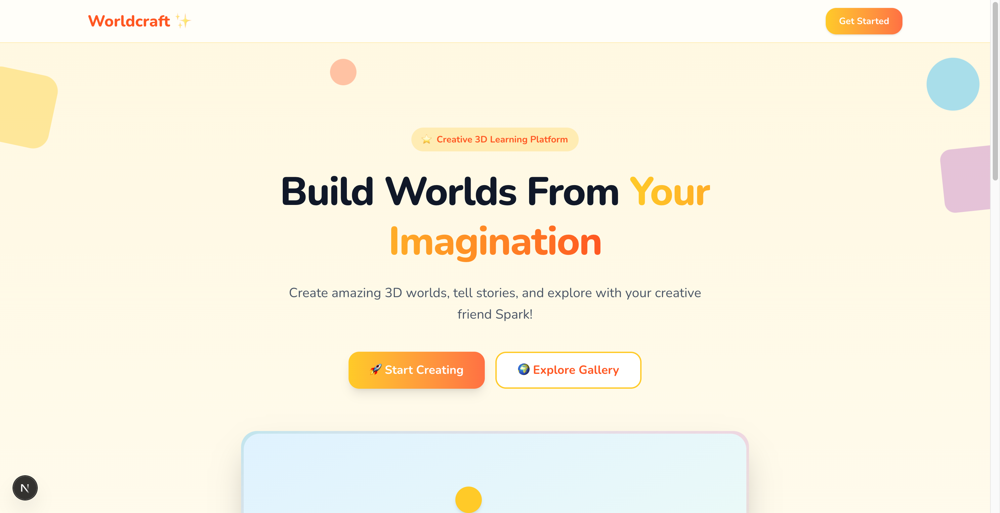 | 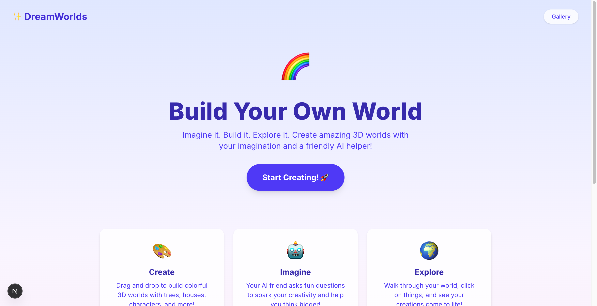 |  |  |

### 월드 빌더

| vanilla | oma | omc | ecc | superpowers |
|---|---|---|---|---|
|  |  | 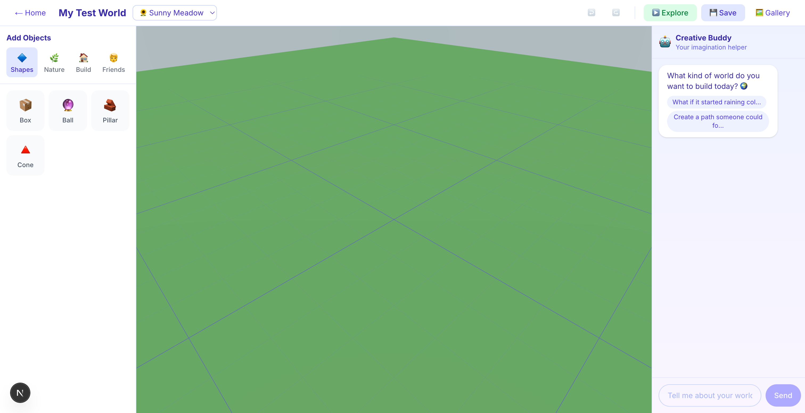 |  |  |

### AI 패널

| vanilla | oma | omc | ecc | superpowers |
|---|---|---|---|---|
|  | 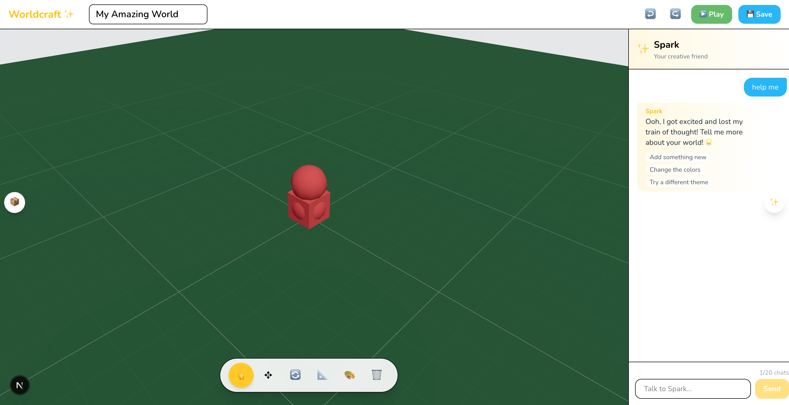 | 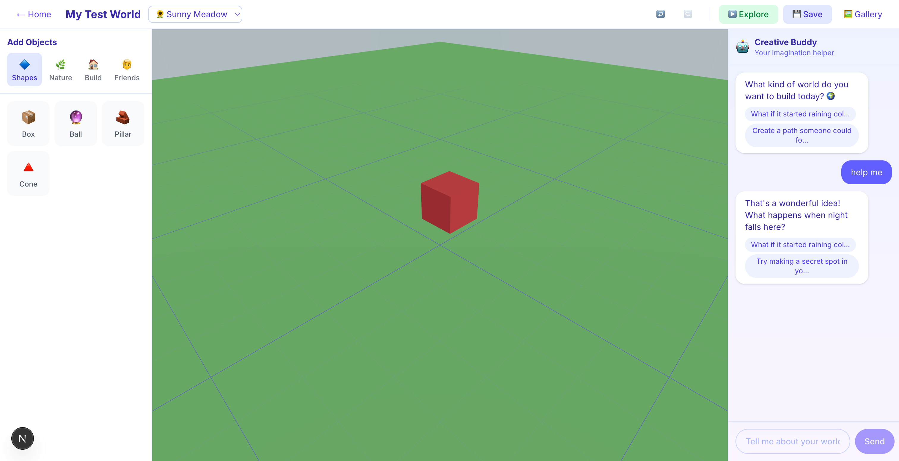 |  |  |

### 갤러리

| vanilla | oma | omc | ecc | superpowers |
|---|---|---|---|---|
|  |  | 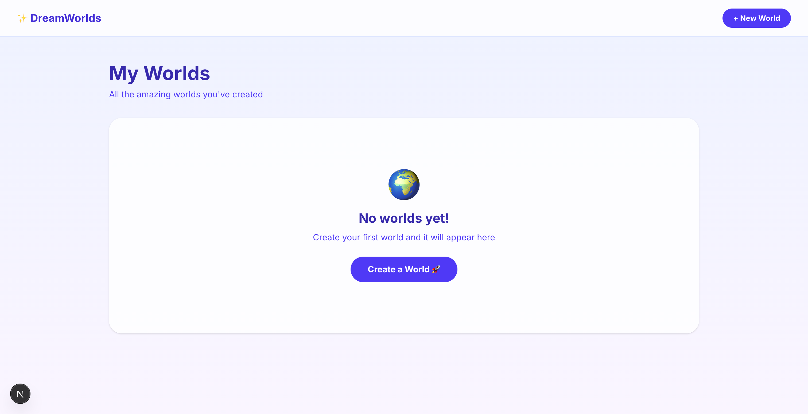 |  |  |

### 객체 배치

| vanilla | oma | omc | ecc | superpowers |
|---|---|---|---|---|
|  | 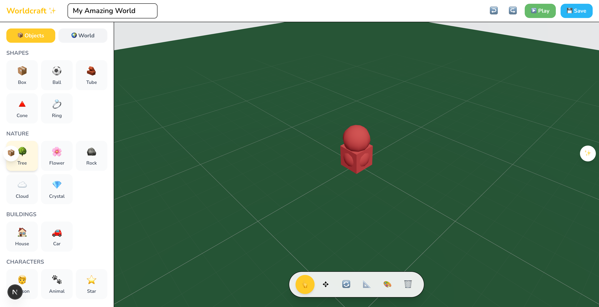 | 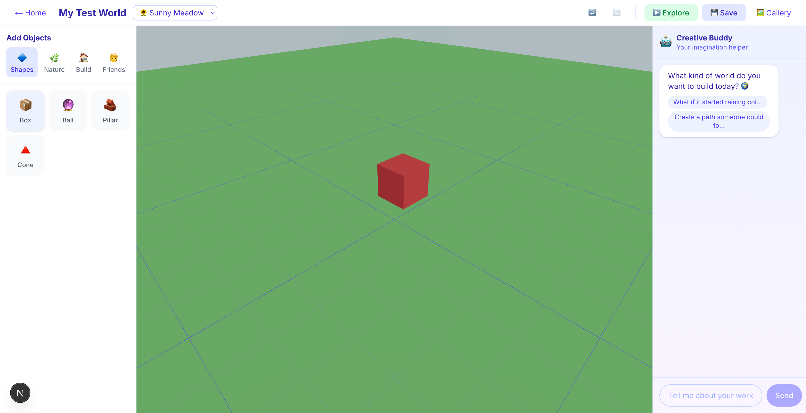 |  |  |

### 환경/테마 변경

| vanilla | oma | omc | ecc | superpowers |
|---|---|---|---|---|
|  | 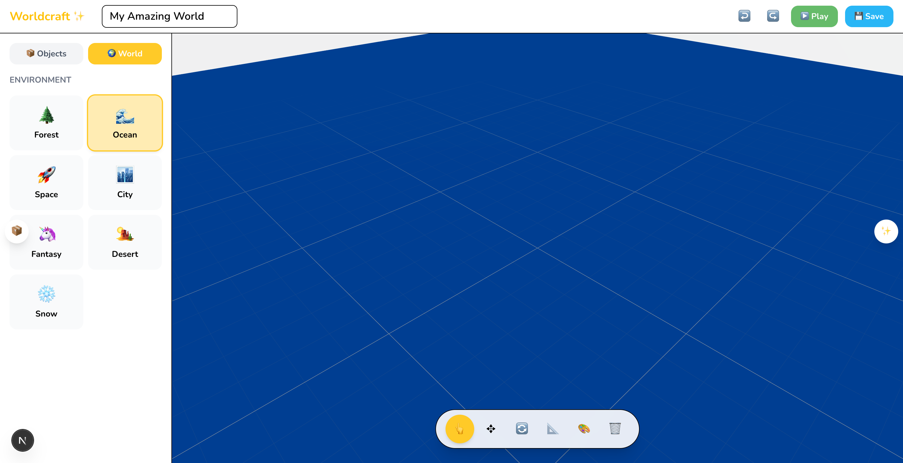 | 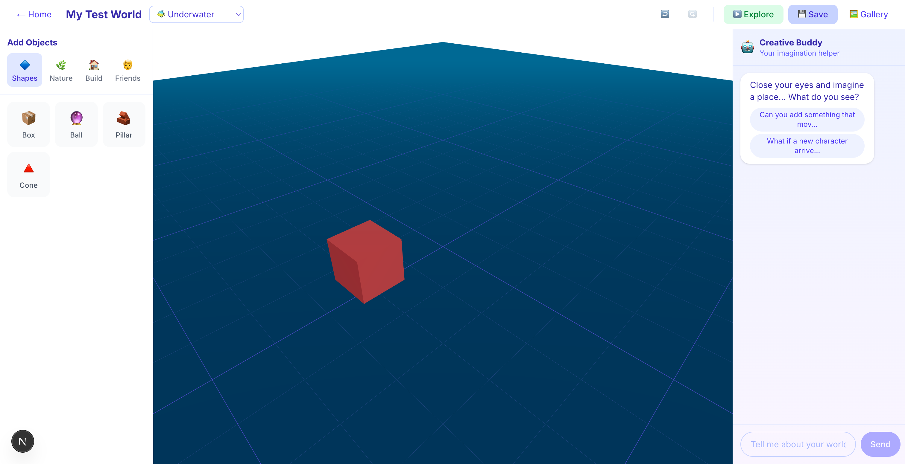 |  |  |

### 저장 → 새로고침 (상태 유지)

| vanilla | oma | omc | ecc | superpowers |
|---|---|---|---|---|
|  | 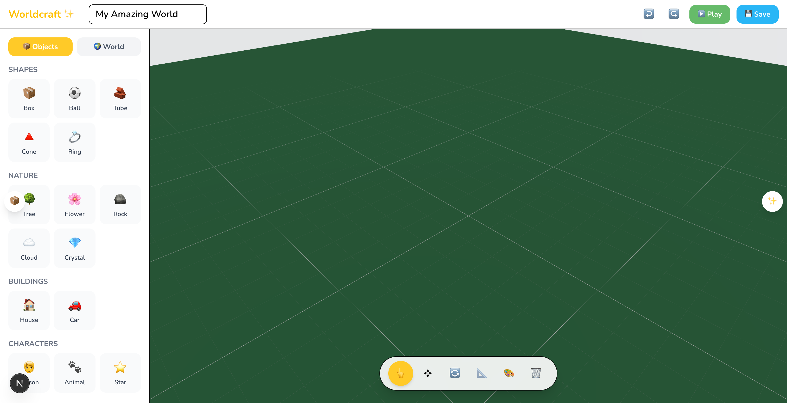 | 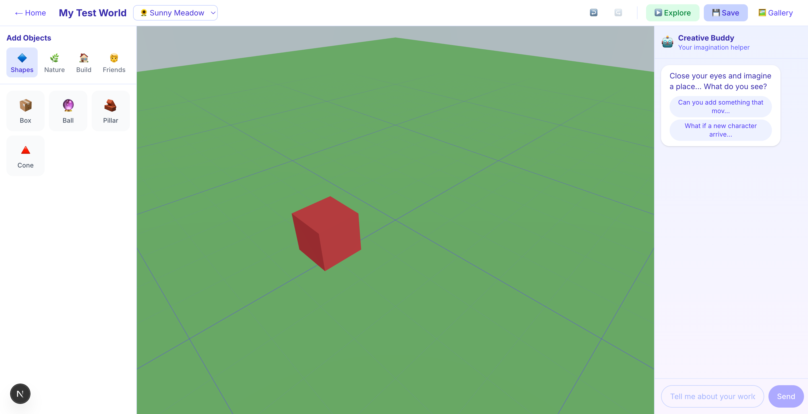 |  |  |

> `journey-save` 축 근거. 3/3 받은 하네스는 저장된 월드를 새로고침 후
> 완전 복원합니다. 1.5/3 받은 하네스는 갤러리 카드만 남고 캔버스가
> 새로고침 후 다시 그려지지 않습니다.

---

## 하네스별 분석


### 🥇 oma (88.0)

- **Functional 35/35**. 모든 journey + build/boot/lint/ts 통과.
- **Spec 13/15**. PASS: `product-concept,personas,journeys,feature-list,ia,ui-direction,tech-arch,db-schema,ai-prompts,safety,impl-plan,starter-code,priority-screens`. real-api 보너스 0/2.
- **Visual 16/20**. anti-patterns 4/5 (anti-pattern 1개. 사이드바 카테고리 라벨과 랜딩 카드 설명이 16px 미만으로 보임...). accessibility 3/5.
- **Engineering 16/20**. breadth: routes=6 components=13. type: strict=true any_count=2. modularity: max_depth=8 max_file_lines=294. transparency 마커: 3.0/4. env: 하드코딩된 키도 env 참조도 없음.
- **Efficiency 8/10**. 18턴 / 2m 42s / 총 $6.57 (파일당 약 $0.51).

### 🥈 superpowers (74.0)

- **Functional 30/35**. lint 실패.
- **Spec 8/15**. PASS: `feature-list,ia,db-schema,ai-prompts,safety,starter-code`. FAIL: `product-concept,personas,journeys,ui-direction,tech-arch,impl-plan,priority-screens`. real-api 보너스 2/2.
- **Visual 14/20**. anti-patterns 4/5 (랜딩과 갤러리에 부드러운 핑크에서 블루로 가는 그라디언트 배경이 보임. anti-pattern 1개로 카운트...). accessibility 3/5.
- **Engineering 14/20**. breadth: routes=4 components=9. type: strict=true any_count=0. modularity: max_depth=8 max_file_lines=258. transparency 마커: 0.0/4. env: env 설정 있음, 하드코딩된 키 없음.
- **Efficiency 8/10**. 39턴 / 8m 13s / 총 $1.28 (파일당 약 $0.14).

### 🥉 omc (73.0)

- **Functional 33.5/35**. save-reload 만 1.5/3.
- **Spec 7/15**. PASS: `product-concept,feature-list,ai-prompts,starter-code,priority-screens`. FAIL: `personas,journeys,ia,ui-direction,tech-arch,db-schema,safety,impl-plan`. real-api 보너스 2/2.
- **Visual 13/20**. anti-patterns 3/5 (anti-pattern 2개. 일부 AI suggestion-chip 과 metadata 텍스트가 16px 환산 미만, builder...). accessibility 2/5.
- **Engineering 14.5/20**. breadth: routes=4 components=5. type: strict=true any_count=0. modularity: max_depth=8 max_file_lines=172. transparency 마커: 0.0/4. env: env 설정 있음, 하드코딩된 키 없음.
- **Efficiency 5/10**. 61턴 / 9m 02s / 총 $1.92 (파일당 약 $0.38).

### 4. vanilla (69.0)

- **Functional 28.5/35**. lint 실패, save-reload 만 1.5/3.
- **Spec 12/15**. PASS: `product-concept,personas,journeys,feature-list,ia,ui-direction,tech-arch,db-schema,ai-prompts,safety,impl-plan,starter-code`. FAIL: `priority-screens`. real-api 보너스 0/2.
- **Visual 10/20**. anti-patterns 1/5 (랜딩 페이지의 보라에서 블루로 가는 그라디언트 hero, 본문/메타데이터 텍스트가 여러 곳에서 16px 미만으로 보임...). accessibility 2/5.
- **Engineering 12.5/20**. breadth: routes=5 components=6. type: strict=true any_count=0. modularity: max_depth=7 max_file_lines=473. transparency 마커: 0.0/4. env: 하드코딩된 키도 env 참조도 없음.
- **Efficiency 6/10**. 42턴 / 8m 56s / 총 $2.37 (파일당 약 $0.40).

### 5. ecc (68.5)

- **Functional 28.5/35**. lint 실패, save-reload 만 1.5/3.
- **Spec 8/15**. PASS: `feature-list,tech-arch,db-schema,ai-prompts,starter-code,priority-screens`. FAIL: `product-concept,personas,journeys,ia,ui-direction,safety,impl-plan`. real-api 보너스 2/2.
- **Visual 13/20**. anti-patterns 3/5 (랜딩 페이지에 떠있는 그라디언트 orb/blob (노란색 원, 핑크 사각형, 보라색 원, 초록...)). accessibility 2/5.
- **Engineering 15/20**. breadth: routes=4 components=13. type: strict=true any_count=0. modularity: max_depth=8 max_file_lines=167. transparency 마커: 0.0/4. env: env 설정 있음, 하드코딩된 키 없음.
- **Efficiency 4/10**. 79턴 / 10m 20s / 총 $3.84 (파일당 약 $0.30).

---

## 점수 산출 방식

| 축 | 가중치 | 핵심 신호 | 도구 |
|---|---|---|---|
| **Functional** | 35 | build exit, dev-server boot (HTTP 200, 45초 이내), 5개 user-journey 점검, lint, ts-clean | `pm install/build/lint`, curl, chrome-devtools MCP, `tsc --noEmit` |
| **Spec** | 15 | prompt 가 명시한 13개 산출물 (문서 또는 최종 답변), real-API 보너스 | brace-balanced JSON 추출기를 갖춘 LLM judge |
| **Visual** | 20 | anti-pattern (그라디언트 배경, 16px 미만 텍스트, 카드 중첩 등), 아동 친화 UX, 디자인 시스템 일관성, 접근성 | 스크린샷 기반 LLM judge |
| **Engineering** | 20 | 코드 폭, TS strict, 최대 파일 크기 + 폴더 깊이, deferred-stub 마커, 하드코딩된 키 부재 | 정적 분석 (jq + grep + find) |
| **Efficiency** | 10 | 완료까지의 턴 수, wall-clock 시간, 파일당 비용 | `claude -p` 결과 JSON |

구현은 `benchmarks/scoring/multiaxis/score.sh` 가 담당하며 하네스별로
`multiaxis-score.json` 과 `multiaxis-summary.json` 을 출력합니다. 이 README
자체는 `benchmarks/scoring/multiaxis/build-report.sh` 가 자동 생성합니다.

---

## 정직한 caveats

1. **superpowers prompt 우회**. 비대화형 모드에서 하네스가 동작하려면 필요했습니다. 결과는 "brainstorming gate 가 우회된 후 superpowers 가 할 수 있는 것" 이며 완전한 동일 조건 비교는 아닙니다.
2. **oma lint 면제**. `next lint` (oma 는 Next 15.5 사용) 는 Next 16+ 환경에서 interactive prompt 를 띄웁니다. 본질적이지 않은 setup 차이로 점수를 깎지 않기 위해 `lint-clean: 5/5 (n/a, infrastructure)` 면제를 적용했습니다.
3. **LLM judge 1회 측정**. spec/visual/journey judge 가 한 번씩만 돌았습니다. 재측정 시 축당 ±2~3점 변동이 예상됩니다.
4. **Engineering transparency 항목**. oma 만 1점 이상 받았습니다 (oma 룰이 deferred-stub 마커 사용을 권장하기 때문). 항목 자체는 의미 있는 신호를 측정하지만 oma 가 구조적으로 과대 대표됩니다.
5. **비용 정규화**. efficiency 는 파일당 비용을 사용합니다. 5개 하네스 절대 비용 ($1.28 ~ $6.57) 차이는 축 점수에 직접 반영되지 않습니다.

---

## 재현 방법

```bash
# 1. 5개 하네스 순차 실행 (~45분, API 비용 약 $15-20)
./benchmarks/run.sh

# 2. 하네스별 multiaxis 채점 (5축, 100점). 현재 표준 채점 시스템
for h in vanilla oma omc ecc superpowers; do
  ./benchmarks/scoring/multiaxis/score.sh \
    /tmp/oma-benchmark-<timestamp>/projects/$h \
    $h \
    /tmp/oma-benchmark-<timestamp>/results/$h.json \
    /tmp/oma-benchmark-<timestamp>/multiaxis/$h
done

# 3. multiaxis 결과로부터 이 README 생성
./benchmarks/scoring/multiaxis/build-report.sh \
  /tmp/oma-benchmark-<timestamp> \
  $(pwd)
```
